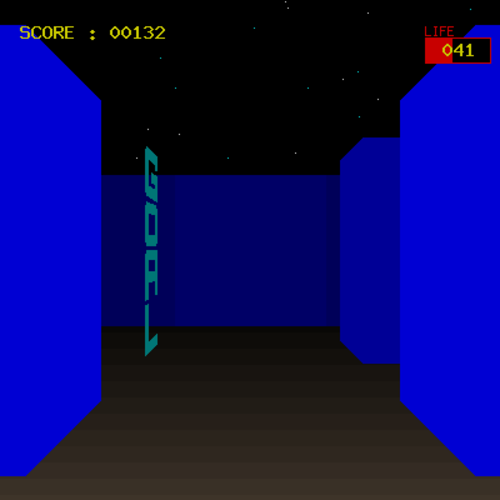

# PHP-MAZE #

## 概要 ##
PHPで動作する3D迷路です。
LIFEがゼロにならないようにラーメンを食べながら出口を探せ！

It is a 3D maze running on PHP.
Look for an exit while eating ramens, so that LIFE will not be zero !

### Demo Page ###  
http://www.planet-green.com/cgi/3d_maze_public/sample/maze.php

## 動作環境 / environment ##

PHP 7.0で動作確認済。

## 設置方法 / Install ##

ファイル設置後、ranking.txt(スコア記録用ファイル。初期状態ではサイズゼロの空ファイル)のパーミッションを666(rw-rw-rw-)に変更してください。  
maze.phpをブラウザで開くとプレイできます。

After installing the file, change the permission of ranking.txt to 666(rw-rw-rw-).  
open maze.php in your browser.

## 備考 / Note ##
迷路を変更したい時は config.inc.php を修正してください。
ソースを見ればわかると思います。

When you want to change the maze please modify config.inc.php.

## Author ##

Author: Tomoya Kawabata   
Home Page: https://planet-green.com/  

## License ##
GPL v3